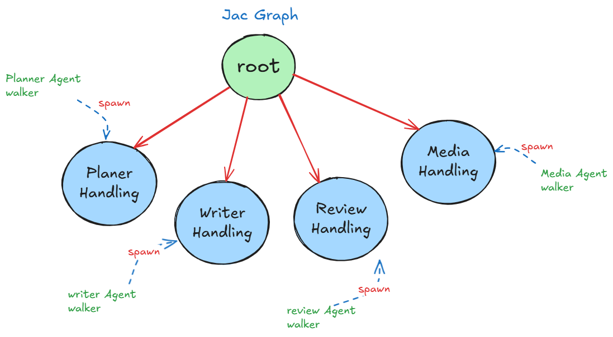

# Content Creator - Approach 1

A multi-agent system for automated content creation using Jac language, featuring intelligent workflow orchestration and specialized agents for planning, writing, reviewing, and media generation.

## Architecture

The system is built on **Jaseci Stack** where **agents are walkers** that navigate through **nodes as toolboxes**.



*Diagram: Walkers (agents) spawn at toolbox nodes to access specialized tools*

### Core Concept

- **Walkers (Agents)**: Mobile entities that traverse the graph to execute tasks
- **Nodes (Toolboxes)**: Stationary containers holding specialized tools and functions
- **Execution Flow**: Walkers spawn at relevant nodes and utilize the tools within those toolboxes

### Walker-Node Interactions

| Walker | Node (Toolbox) | Tools Available |
|--------|----------------|-----------------|
| `planner_agent` | `PlanerHandling` | `plan_the_content()` |
| `writer_agent` | `WriterHandling` | `write_the_content()`, `perform_tavily_search()` |
| `review_agent` | `ReviewHandling` | `review_the_content()` |
| `media_agent` | `MediaHandling` | `create_prompt_to_generate_media()`, `generate_media_for_article()` |

### SupervisorAgent Logic
The `SupervisorAgent` walker determines which toolbox is needed and spawns the appropriate agent walker at that node to utilize the required tools.

## Features

- **Intelligent Routing**: Dynamic agent selection based on current state
- **Web Search Integration**: Real-time information gathering via Tavily
- **Quality Control**: Automated review and revision process
- **Media Generation**: Automatic image creation for content
- **Session Management**: Persistent state across agent interactions
- **Output Tracking**: JSONL logging of all agent interactions

## Installation

1. **Clone and navigate to the directory**:
   ```bash
   cd content_creator/byLLM/approach_1
   ```

2. **Install dependencies**:
   ```bash
   pip install -r requirements.txt
   ```

3. **Set up environment variables**:
   ```bash
   cp .env.example .env
   # Edit .env with your API keys
   ```

4. **Required API Keys**:
   - `OPENAI_API_KEY`: For GPT models and DALL-E image generation
   - `TAVILY_API_KEY`: For web search functionality

## Usage

Run the content creator:
```bash
jac run main.jac
```

### Configuration

Edit the `user_input` dictionary in `main.jac` to customize:

```python
user_input = {
    "field": "technology",
    "topic": "The Future of AI in Content Creation",
    "output_format": "markdown",
    "tone": "informative and engaging",
    "audience": "tech enthusiasts and professionals",
    "write_as": "personal blog post",
}
```

## Output Files

- `final_output.md`: Final generated content
- `output.jsonl`: Agent interaction logs
- `article_image.png`: Generated media (if applicable)

## Execution Flow

1. **Planning Phase**: Creates content structure and outline
2. **Writing Phase**: Researches topic and writes initial content
3. **Review Phase**: Evaluates quality and suggests improvements (up to 3 iterations)
4. **Media Phase**: Generates relevant images for the content
5. **Completion**: Saves final output and terminates

## Dependencies

- **byllm**: Jac LLM integration
- **openai**: GPT and DALL-E API access
- **tavily-python**: Web search capabilities
- **python-dotenv**: Environment variable management

## Architecture Notes

- **Jac Graph Paradigm**: Walkers (agents) navigate through nodes (toolboxes) to access specialized tools
- **Toolbox Design**: Each node contains domain-specific functions that walkers can utilize
- **Dynamic Navigation**: SupervisorAgent intelligently routes walkers to appropriate toolboxes
- **Tool Selection**: Walkers find and execute the most relevant tools within their target toolbox
- **Session Persistence**: State is maintained across walker movements and toolbox interactions